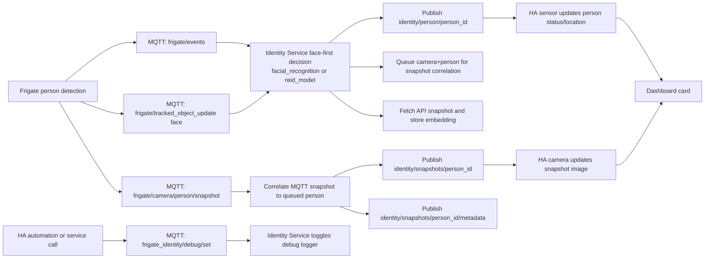
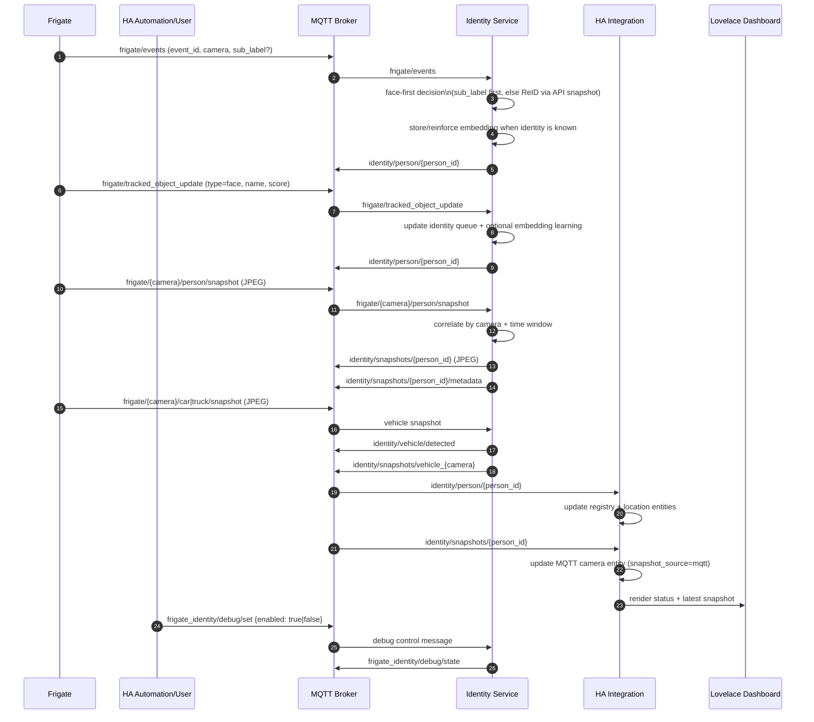

**Frigate Identity Service**

Lightweight ReID service that provides person identification continuity for Frigate. Uses facial recognition as the primary identity source and ReID (re-identification) to maintain identity when faces are not visible.

**Architecture:**

- **Input Layer (MQTT + Frigate API):**
  - Subscribes to `frigate/events` and `frigate/tracked_object_update` for person identity signals
  - Subscribes to `frigate/+/person/snapshot` for fast person snapshots, plus car/truck snapshot topics for vehicle events
  - Uses Frigate HTTP API snapshots for the accurate identity/embedding path

- **Identity Decision Layer (Face-first, ReID fallback):**
  - **Primary:** Frigate face recognition (`sub_label` from events or `tracked_object_update` face payload)
  - **Fallback:** ReID embedding extraction + cosine similarity matching against stored embeddings
  - Publishes identity updates to `identity/person/{person_id}`

- **Two Snapshot Paths (Speed vs Accuracy):**
  - **Fast display path:** MQTT snapshot is temporally correlated to recent per-camera detections, then published to `identity/snapshots/{person_id}`
  - **Accurate learning path:** API snapshot is used for embedding extraction and persistence in `EmbeddingStore`
  - Correlation metadata is published to `identity/snapshots/{person_id}/metadata`

- **Persistence and Matching:**
  - `EmbeddingStore` keeps multiple recent embeddings per person in `embeddings.json` (recency-aware format)
  - `EmbeddingMatcher` supports recency decay (`linear`, `exponential`, `none`) and optional confidence weighting
  - Retention policy is scheduler-driven: `age_prune`, `full_clear_daily`, or `manual`

- **Operations and Observability:**
  - Debug logging can be toggled at runtime via `frigate_identity/debug/set`
  - Nightly debug-log cleanup and periodic health heartbeat run via `APScheduler`
  - Vehicle snapshots emit `identity/vehicle/detected` and retained vehicle snapshot topics for dashboard usage

**ReID Model Selection:**

The service uses [torchreid](https://github.com/KaiyangZhou/deep-person-reid) to load
dedicated person re-identification models such as OSNet.  Set the `REID_MODEL`
environment variable (or the `reid_model` option in `config.yaml`) to choose
a model:

| Model | Embedding dim | Notes |
|-------|--------------|-------|
| `osnet_x1_0` (default) | 512 | Best accuracy, recommended |
| `osnet_x0_75` | 512 | Lighter variant |
| `osnet_x0_5` | 512 | Lighter variant |
| `osnet_x0_25` | 512 | Lightest OSNet |
| `osnet_ibn_x1_0` | 512 | OSNet + Instance Batch Norm |
| `osnet_ain_x1_0` | 512 | OSNet + Attention Instance Norm |
| `resnet50` | 2048 | Generic ImageNet fallback (no torchreid required) |

If torchreid is not installed and a torchreid model is requested, the service
automatically falls back to ResNet50.  Both GPU (`cuda`) and CPU-only modes are
fully supported.

**Environment Variables:**

| Variable | Default | Description |
|----------|---------|-------------|
| `MQTT_BROKER` | `localhost` | MQTT broker hostname |
| `MQTT_PORT` | `1883` | MQTT broker port |
| `MQTT_USERNAME` | (optional) | MQTT authentication username |
| `MQTT_PASSWORD` | (optional) | MQTT authentication password |
| `FRIGATE_HOST` | `http://localhost:5000` | Frigate HTTP API endpoint |
| `REID_MODEL` | `osnet_x1_0` | ReID model name (`osnet_x1_0`, `osnet_x0_75`, `osnet_x0_5`, `osnet_x0_25`, `osnet_ibn_x1_0`, `osnet_ain_x1_0`, or `resnet50`) |
| `REID_DEVICE` | `auto` | Device for ReID (`auto`, `cuda`, `cpu`) |
| `REID_SIMILARITY_THRESHOLD` | `0.75` | Minimum similarity score for ReID match |
| `EMBEDDINGS_DB_PATH` | `embeddings.json` | Path to store person embeddings |
| `EMBEDDING_RETENTION_MODE` | `age_prune` | Embedding retention policy: `age_prune`, `full_clear_daily`, or `manual` |
| `EMBEDDING_MAX_AGE_HOURS` | `48` | Max embedding age before removal when `EMBEDDING_RETENTION_MODE=age_prune` |
| `EMBEDDING_PRUNE_INTERVAL_MINUTES` | `30` | How often expired embeddings are pruned in `age_prune` mode |
| `EMBEDDING_FULL_CLEAR_TIME` | `00:00` | Daily clear time (`HH:MM` 24h) when `EMBEDDING_RETENTION_MODE=full_clear_daily` |
| `SNAPSHOT_CORRELATION_WINDOW` | `2.0` | Seconds to correlate MQTT snapshots to persons |
| `MAX_TRACKED_PERSONS_PER_CAMERA` | `3` | Max persons tracked per camera for correlation |
| `DEBUG_LOGGING_ENABLED` | `false` | Enable debug logging for misidentification analysis |
| `DEBUG_LOG_PATH` | `debug/` (or `/data/debug` in container) | Path to store debug logs and snapshots |
| `DEBUG_SAVE_EMBEDDINGS` | `false` | Include full embeddings in debug JSON (high storage) |
| `DEBUG_RETENTION_DAYS` | `7` | How many days to retain debug logs before auto-delete |

**MQTT Topics:**

**Subscriptions:**
- `frigate/events` - Tracked object updates (new/update/end); contains face recognition via `sub_label` field ([Frigate docs](https://docs.frigate.video/integrations/mqtt#frigateevents))
- `frigate/tracked_object_update` - Face recognition and LPR metadata updates ([Frigate docs](https://docs.frigate.video/integrations/mqtt#frigatetracked_object_update))
- `frigate/+/person/snapshot` - Person snapshots (fast display)
- `frigate/+/car/snapshot` - Vehicle detection
- `frigate/+/truck/snapshot` - Vehicle detection
- `frigate_identity/debug/set` - Runtime debug logging toggle control

**Publications:**
- `identity/person/{person_id}` - Person identity events
- `identity/snapshots/{person_id}` - Person-specific snapshot images
- `identity/snapshots/{person_id}/metadata` - Snapshot correlation metadata
- `identity/vehicle/detected` - Vehicle detection events
- `frigate_identity/debug/state` - Current debug logging state

**Snapshot Flow (Detection → Dashboard)**

Simplified flowchart:



Sequence diagram (topic-by-topic):



**Files:**
- **`identity_service.py`**: Main service consuming Frigate events and publishing identity messages. See [identity_service.py](identity_service.py).
- **`requirements.txt`**: Python dependencies (GPU-capable). See [requirements.txt](requirements.txt).
- **`requirements-cpu.txt`**: CPU-only Python dependencies for Home Assistant Add-on. See [requirements-cpu.txt](requirements-cpu.txt).
- **`Dockerfile`**: Container image build (CPU-only by default; pass `--build-arg USE_GPU=true` for GPU). See [Dockerfile](Dockerfile).
- **`config.yaml`**: Home Assistant Add-on manifest. See [config.yaml](config.yaml).
- **`run.sh`**: Container entry point used by the Home Assistant Add-on. See [run.sh](run.sh).

**Local setup (Windows PowerShell)**

1. Create and activate a virtual environment:

```powershell
python -m venv .venv
& .\.venv\bin\Activate.ps1
```

2. Install dependencies and run:

```powershell
python -m pip install --upgrade pip
python -m pip install -r requirements.txt
python identity_service.py
```

If activation fails, install into the venv directly:

```powershell
.\.venv\bin\python.exe -m pip install -r requirements.txt
.\.venv\bin\python.exe identity_service.py
```

**Docker**

Build and run the container (CPU-only, suitable for most deployments):

```bash
docker build -t frigate-identity .
docker run \
  -v $(pwd)/data:/data \
  --env MQTT_BROKER=host.docker.internal \
  --env MQTT_PORT=1883 \
  frigate-identity
```

**Important:** Mount a volume to `/data` to persist embeddings across container restarts. Without the volume, learned identities will be lost when the container stops.

To build with GPU (CUDA) support:

```bash
docker build --build-arg USE_GPU=true -t frigate-identity-gpu .
docker run \
  --gpus all \
  -v $(pwd)/data:/data \
  --env MQTT_BROKER=host.docker.internal \
  --env MQTT_PORT=1883 \
  frigate-identity-gpu
```

**Configuration:** You can override the embeddings path with `EMBEDDINGS_DB_PATH`:
```bash
docker run \
  -v /my/custom/path:/persistent \
  --env EMBEDDINGS_DB_PATH=/persistent/my-embeddings.json \
  --env MQTT_BROKER=host.docker.internal \
  frigate-identity
```

Embedding retention defaults to age-based pruning (no scheduled full reset). To retain legacy behavior, set:

```bash
EMBEDDING_RETENTION_MODE=full_clear_daily
EMBEDDING_FULL_CLEAR_TIME=00:00
```

**Home Assistant Add-on**

This repository can be used directly as a Home Assistant Add-on repository.  GPU acceleration is not required when deployed as an Add-on; the service falls back to CPU-based ReID automatically.

1. In Home Assistant, navigate to **Settings → Add-ons → Add-on Store**.
2. Click the three-dot menu (⋮) and select **Repositories**.
3. Add this repository URL: `https://github.com/awayman/frigate_identity_service`
4. Find **Frigate Identity Service** in the store and click **Install**.
5. Configure the add-on options (MQTT broker, Frigate host, etc.) and click **Start**.

Configuration is written by the Supervisor to `/data/options.json` and is read automatically on startup.  All options from `config.yaml` map to the environment variables listed above (e.g. `mqtt_broker` → `MQTT_BROKER`).

> **Note:** GPU acceleration is not available in Home Assistant Add-on deployments.  The ReID model runs on CPU, which is sufficient for most home use cases.  For GPU-accelerated deployments, use the standalone Docker image built with `--build-arg USE_GPU=true`.

**Debug Logging**

If you experience misidentifications, debug logging helps diagnose whether issues stem from Frigate's facial recognition or the ReID model.

**Enable Debug Logging:**

Via environment variable:
```bash
DEBUG_LOGGING_ENABLED=true
DEBUG_LOG_PATH=/data/debug
DEBUG_SAVE_EMBEDDINGS=false
DEBUG_RETENTION_DAYS=7
```

Via Home Assistant Add-on UI or MQTT:
```bash
mosquitto_pub -t frigate_identity/debug/set -m '{"enabled": true}'
```

The service publishes retained debug status to `frigate_identity/debug/state` so dashboards/automations can read current state after restart.

**Storage:**
- Snapshots: `/data/debug/snapshots/{date}/`
- Logs: `/data/debug/logs/{date}_*.jsonl` (JSONL format for easy parsing)
- Automatic cleanup: Logs older than `DEBUG_RETENTION_DAYS` are deleted daily at 1 AM

**Logs Generated:**
- `{date}_facial_recognition.jsonl` - Frigate facial recognition events with snapshots
- `{date}_reid_matches.jsonl` - ReID matching results (successful and failed matches)
- `{date}_correlation_issues.jsonl` - MQTT snapshot correlation warnings (multi-person scenarios)

**Analyze Logs:**

```bash
python analyze_debug_logs.py \
  --debug-path /data/debug \
  --start-date 2026-02-25 \
  --output-dir ./reports
```

Output:
- `reports/report.html` - Interactive HTML report with metrics and visualizations
- `reports/summary.csv` - All events in CSV format for spreadsheet analysis
- `reports/metrics.json` - Aggregated statistics

**Dashboard Example:**

The [examples/debug_dashboard.yaml](examples/debug_dashboard.yaml) provides a Home Assistant dashboard for managing debug mode and analyzing results. Import it via Home Assistant's dashboard editor.


- Select the workspace interpreter (Command Palette → "Python: Select Interpreter") and choose the `.venv` interpreter.
- If the editor still flags imports, reload the window or restart the Python language server.

**Configuration Files**

- `.env` - Environment configuration (copy from `.env.example`)
- `persons.yaml` - Person roles, ages, and supervision requirements
- `embeddings.json` - Stored person embeddings (auto-generated)

**Testing**

Run the test script to validate your setup:

```powershell
python test_system.py
```

This will check:
- MQTT broker connectivity
- Frigate API accessibility
- MQTT topic subscriptions
- Publish test events

**Event Day Filtering (Real Frigate Tests)**

When running real Frigate integration tests, you can target a specific UTC day:

```powershell
# Exact UTC date
$env:FRIGATE_EVENT_DATE = "2026-03-01"
pytest tests/test_real_frigate.py -v -s

# Relative UTC day (0=today, 1=yesterday)
Remove-Item Env:FRIGATE_EVENT_DATE -ErrorAction SilentlyContinue
$env:FRIGATE_EVENT_DAYS_AGO = "1"
pytest tests/test_real_frigate.py -v -s
```

Using the integration runner:

```powershell
python run_integration_tests.py --real-frigate-host http://192.168.1.100:5000 --event-date 2026-03-01
python run_integration_tests.py --real-frigate-host http://192.168.1.100:5000 --days-ago 1
```

Set only one filter at a time:
- `FRIGATE_EVENT_DATE` (format: `YYYY-MM-DD`)
- `FRIGATE_EVENT_DAYS_AGO` (integer `>= 0`)

For full test workflows, see [TESTING.md](TESTING.md).

**Troubleshooting**
- Import error for `paho.mqtt.client`: ensure `paho-mqtt` is installed in the active interpreter (`python -m pip install paho-mqtt`).
- Unable to connect to MQTT broker: check `MQTT_BROKER`/`MQTT_PORT` env vars and network reachability.
- No snapshots appearing: verify Frigate MQTT config has `crop: true` enabled

**Home Assistant Integration**

The Home Assistant integration has been moved to a separate repository for HACS compatibility:

📦 **[Frigate Identity HA](https://github.com/awayman/frigate-identity-ha)**

This repository contains:
- The core Frigate Identity Service (this repo)
- Standalone deployment via Docker or Python
- Home Assistant Add-on manifest for deployment as a Home Assistant add-on

For Home Assistant integration, see the separate repository above for:
- HACS installation instructions
- Home Assistant custom component setup
- Integration configuration and sensors
